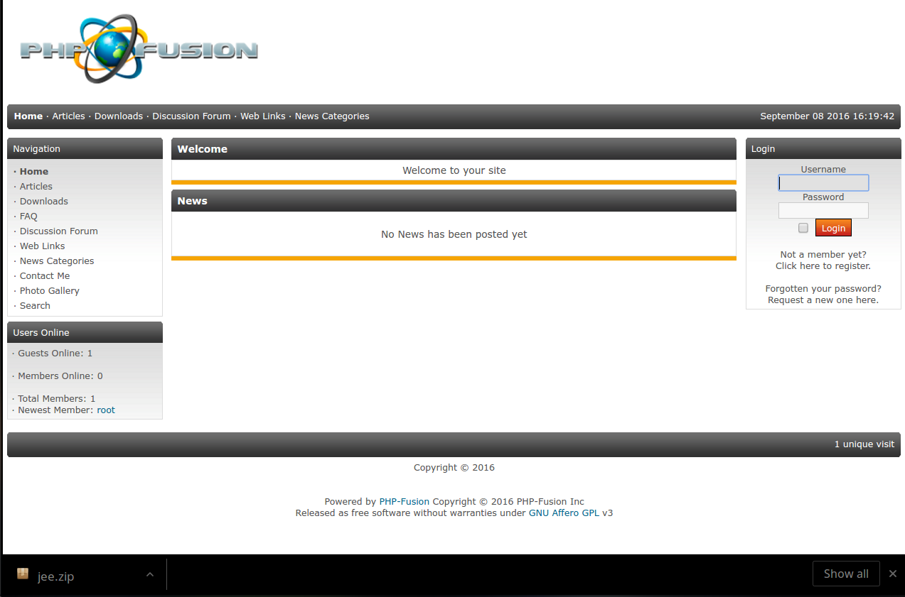

# DevOps Challenge 2 - PHP Application with MySQL Database

## Time to complete: 4 hours

## Objective
Create a Docker container or VM to host the PHP application called PHP-Fusion, which can be downloaded from https://sourceforge.net/projects/php-fusion/files/latest/download?source=files, or your instructor may provide it.

This application container should consist of;
* PHP
* PHP-FPM
  * Only if you use NGINX
* NGINX or Apache
* PHP-Fusion files directory

You will also need connection to the MySQL database server.
There should be a single Docker container for the application, which should contain NGINX and PHP-FPM, and it should be able to connect to your MySQL database server.

## Before automation
Before you can fully automate the process you will need to install the application manually once so that you can;
* Capture your config.php and apply it to your Chef recipe as a template
* Capture the **fusion** database so that you can run the script

Your deployment should provide a fully functioning, ready to go PHP Fusion application with the following log in;
* username: root
* password: abc123456
* admin password: 123456abc

You will also need to read the PDF supplied with the application to see what other changes you need to make to make it work.  Remember some of those steps will not be required once you have the config.php and database script.

#### Important information
* You will need to know the username, password and IP address of the MySQL server (or mariadb)
* You will need to have a database called fusion created, but left empty

The **config.php** file after the user has gone through the settings will have the following format;
```
<?php
// database settings
$db_host = "172.17.0.5";
$db_user = "root";
$db_pass = "secret";
$db_name = "fusion";
$db_prefix = "fusion67tl3_";
define("DB_PREFIX", "fusion67tl3_");
define("COOKIE_PREFIX", "fusion5u7T2_");
?>
```

Backup the DB to sql script, that you can run before application deployment
* mysqldump -u root -p --routines --triggers fusion >fusion.sql

## Automating the deployment
Using the tools you have learned you will create a fully automated installation of PHPFusion, such that when deployed to an environment will be ready to log in to using a default user and password.

## On successful deployment
Once your pipeline deploys the application to production it should automatically display;



You should be able to log in as **root** using the password **abc123456**

This will result in;


